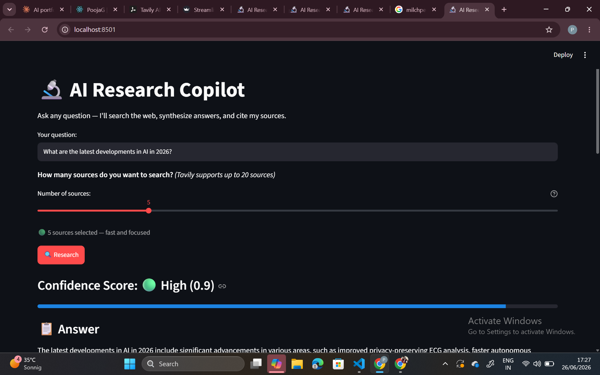

# 🔬 AI Research Copilot

A real-time AI-powered research assistant that searches the web, synthesizes information from multiple sources, and delivers cited answers with confidence scoring — all in seconds.

> Built with Python, LangChain, Groq AI, Tavily, and Streamlit.

---

## 📸 Demo



---

## 🚀 What It Does

1. You type any research question
2. You choose how many sources to search (1-20)
3. Tavily searches the web and retrieves real articles
4. LangChain sends the articles + question to Groq AI
5. Llama 3.3 70B synthesizes a cited answer
6. You see the answer with source citations and a confidence score

---

## 🧠 How It Works — Architecture

```
User types question + selects number of sources
                ↓
app.py → calls research(question, num_sources)
                ↓
agent.py → calls search_web(question, num_sources)
                ↓
tools.py → Tavily API searches the web → returns real articles
                ↓
agent.py → builds context from all articles
                ↓
LangChain chain → sends context + question to Groq AI
                ↓
Llama 3.3 70B → synthesizes answer with [Source X] citations
                ↓
calculate_confidence() → averages Tavily relevance scores
                ↓
app.py → displays answer + confidence score + expandable sources
```

---

## 📁 Project Structure

```
research-copilot/
├── venv/                  → Python virtual environment
├── research_copilot/
│   ├── app.py             → Streamlit frontend UI
│   ├── agent.py           → LangChain AI agent + synthesis logic
│   ├── tools.py           → Tavily web search tool
│   └── .env               → API keys (never committed)
├── requirements.txt       → Python dependencies
└── .gitignore
```

---

## 🛠️ Tech Stack

| Tool                 | Purpose                                      |
| -------------------- | -------------------------------------------- |
| Python               | Programming language                         |
| Streamlit            | Frontend UI — turns Python into a web app   |
| LangChain            | AI framework — chains prompt + LLM together |
| Groq + Llama 3.3 70B | LLM — synthesizes and reasons over sources  |
| Tavily API           | Web search engine built for AI agents        |
| python-dotenv        | Loads secret keys from .env file             |

---

## ⚙️ Setup & Installation

### Prerequisites

- Python 3.9+
- A Groq API key — free at console.groq.com
- A Tavily API key — free at app.tavily.com (1000 searches/month free)

### 1. Clone the repo

```bash
git clone https://github.com/pooja911/ai-research-copilot.git
cd ai-research-copilot
```

### 2. Create virtual environment

```bash
python -m venv venv

# Activate on Windows
venv\Scripts\activate

# Activate on Mac/Linux
source venv/bin/activate
```

### 3. Install dependencies

```bash
pip install -r requirements.txt
```

### 4. Set up environment variables

Create a `.env` file inside the `research_copilot` folder:

```
GROQ_API_KEY=your-groq-api-key
TAVILY_API_KEY=tvly-your-tavily-key
```

**Where to get each key:**

- `GROQ_API_KEY` → console.groq.com → API Keys → Create key (free)
- `TAVILY_API_KEY` → app.tavily.com → Dashboard → copy your key (free)

### 5. Run the app

```bash
cd research_copilot
streamlit run app.py
```

App opens at `http://localhost:8501`

---

## 🔐 How Confidence Scoring Works

Every source Tavily returns has a relevance score between 0 and 1:

- `1.0` = extremely relevant to your question
- `0.5` = somewhat relevant
- `0.1` = barely relevant

The confidence score is the **average of all source relevance scores**:

```
Source 1 score: 0.92
Source 2 score: 0.87
Source 3 score: 0.85
Source 4 score: 0.91
Source 5 score: 0.90
                ↓
Average = 0.89 → 🟢 High Confidence
```

| Score     | Label     | Meaning                          |
| --------- | --------- | -------------------------------- |
| 0.7 - 1.0 | 🟢 High   | Sources are very relevant        |
| 0.4 - 0.7 | 🟡 Medium | Sources are somewhat relevant    |
| 0.0 - 0.4 | 🔴 Low    | Sources may not be very relevant |

---

## 🧩 Key Design Decisions

### 1. User controls number of sources

Instead of hardcoding 5 sources, the user chooses between 1-20 with a slider. More sources = more comprehensive answer but slower. The UI shows the tradeoff clearly:

- 🟢 1-5 sources: Fast and focused
- 🟡 6-10 sources: Balanced
- 🔴 11-20 sources: Comprehensive but slower

### 2. LangChain pipe operator for clean chaining

```python
chain = prompt | llm
response = chain.invoke({...})
```

The `|` operator chains components like an assembly line. The prompt formats the message, the LLM processes it. Adding more steps is as simple as adding more `|` operators.

### 3. Tavily over Google/Bing

Tavily is built specifically for AI agents — it returns clean, structured content from web pages instead of just links. This means the LLM gets actual article text to reason over, not just titles and snippets.

### 4. Groq over OpenAI

Groq runs Llama 3.3 70B for free with extremely fast inference. OpenAI charges per token. For a portfolio project with heavy testing, free + fast beats paid.

### 5. Streamlit over React

Streamlit turns Python into a web app with zero HTML/CSS/JavaScript. For AI/data science projects it's the industry standard — data scientists and ML engineers use it daily.

---

## 💡 Concepts Used

| Concept               | Where it's used                    |
| --------------------- | ---------------------------------- |
| LLM inference         | Groq + Llama 3.3 in agent.py       |
| Prompt engineering    | System + user prompts in agent.py  |
| LangChain chains      | `prompt \| llm` in agent.py       |
| Web search API        | Tavily in tools.py                 |
| Confidence scoring    | calculate_confidence() in agent.py |
| List comprehensions   | scores extraction in agent.py      |
| f-strings             | context building in agent.py       |
| Virtual environments  | venv for dependency isolation      |
| Streamlit UI          | all of app.py                      |
| Environment variables | .env + python-dotenv               |

---

## 🎯 Interview Talking Points

**"Walk me through your architecture"**

> "The user types a question and selects how many sources to search. Tavily searches the web and returns real articles with relevance scores. LangChain builds a prompt with all the article content as context and sends it to Groq's Llama 3.3 70B model. The LLM synthesizes a cited answer referencing the sources. I calculate a confidence score by averaging Tavily's relevance scores and display it with a progress bar."

**"Why did you use LangChain instead of calling the API directly?"**

> "LangChain gives me a clean abstraction for chaining components — prompt formatting, LLM calls, output parsing — using the pipe operator. It also makes it easy to swap providers. If I wanted to switch from Groq to OpenAI, I'd change one line."

**"How does the confidence score work?"**

> "Tavily scores each search result between 0 and 1 based on how relevant it is to the query. I average all the scores to get one confidence number. High confidence means the sources were very relevant to the question. Low confidence means the answer might be less reliable."

**"Why Tavily over Google Search API?"**

> "Tavily is purpose-built for AI agents. It returns structured, clean content from web pages — not just links and snippets. The LLM needs actual article text to reason over and synthesize. Tavily also returns relevance scores which I use for confidence scoring."

**"What would you improve next?"**

> "I'd add conversation history so users can ask follow-up questions. I'd also add source credibility scoring — not all websites are equally reliable. And I'd implement RAG to let users upload their own documents alongside web search."

---

## 🔮 Possible Extensions

- [ ] Conversation history — ask follow-up questions
- [ ] Export answer as PDF or markdown
- [ ] Source credibility scoring — rank sources by domain authority
- [ ] RAG integration — search your own documents alongside the web
- [ ] Multiple search providers — combine Tavily + Wikipedia + ArXiv
- [ ] Answer caching — same question returns cached result instantly
- [ ] Deploy to Streamlit Cloud for permanent free hosting

---

## 📚 What I Learned Building This

- How LangChain chains work using the pipe operator
- How to use Tavily as an AI-native search engine
- How to calculate and display confidence scores
- How prompt engineering affects answer quality
- How to build Python web apps with Streamlit
- The difference between inference engines (Groq) and models (Llama)
- How to structure a Python AI project with virtual environments

---

## 👩‍💻 Author

**Pooja Garg**

- GitHub: [@pooja911](https://github.com/pooja911)

---

*Built as a portfolio project demonstrating AI agent architecture, LLM integration, prompt engineering, and real-time web synthesis.*
